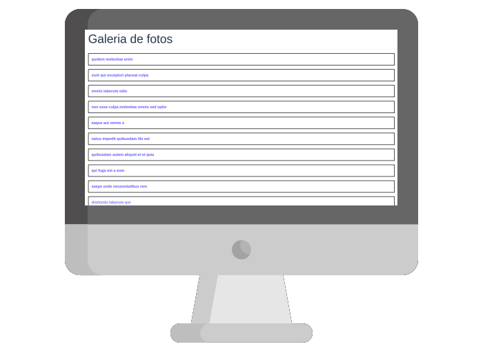

<h1 align="center">JSONPlaceholder Gallery</h1>

    

<h2>:rocket: Tecnologias Usadas</h2>

  
  
  

<h2>:floppy_disk: Instalação</h2>

<code>npm install</code>

<h2>:dvd: Iniciar</h2>

<code>npm run dev</code>

<h2>:computer: Projeto</h2>

Projeto desenvolvido para fins didáticos durante o curso do [Bonyeck Lacerda](https://www.instagram.com/bonieky) na plataforma B7Web.  

Simula a estrutura básica e a navegação de uma galeria.  
Consome dados da fake API JSONPlaceholder.  
Utiliza Axios e React Router Dom.

<h2>:eyes: Implantação</h2>

Veja o projeto em [GitHub Pages](https://caiquedv.github.io/jsonplaceholder-axios-gallery/).
